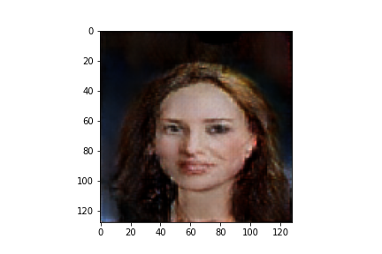

# 1. Deep Convolutional Generative Adversarial Network
This code base uses tensor-flow to make two neural networks, one classifying images as being either real or fake and the other generates 128x128x3 images from a 100 interger Gaussian noise distribution. Using gradients derived from the loss(Binary Cross Entropy)the two networks train in unison with a goal of reaching a state Nash equilibrium. That is the classifying network can no longer distinguish between real or generated images beyond resorting to a coin toss and half the images produced by the generator are labeled as real by the discriminator and the other half as fake, thus reaching convergence. The dataset used to train the discriminator was 30,000 images of faces from the ([Large-scale CelebFaces Attributes (CelebA) Dataset](http://mmlab.ie.cuhk.edu.hk/projects/CelebA.html).

## Examples:

# Deep_conv_gen_gan
# Deep_conv_gen_gan
